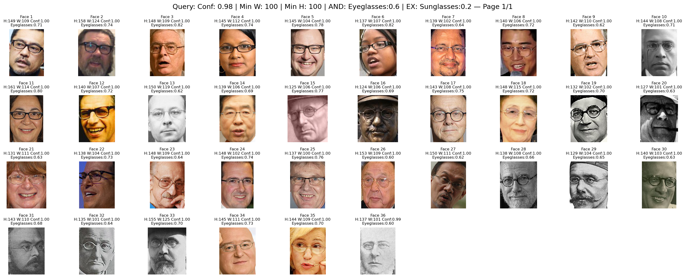

# WIT Face Detection and Analysis Pipeline

This repository implements a comprehensive pipeline for detecting, analyzing, and querying faces in the Wikimedia Image Text (WIT) dataset. The system uses MTCNN for face detection and YOLOv8x (trained specifically on
OpenImagesV7) for additional attribute detection.

While the instructions of the assignment were specific to querying for 100x100 faces with Eyeglasses, I built this tool to be scalable and allow far more robust querying as desired by researchers.

## 📋 Table of Contents
1. [Environment Setup](#environment-setup)
2. [Dataset Download](#dataset-download)
3. [Pipeline Steps](#pipeline-steps)
4. [Usage Guide](#usage-guide)
5. [Output Structure](#output-structure)

---

## 📂 Project Structure

```
wit-face-evaluation/
├── data/                             # Dataset directories
│   ├── raw/                          # Raw parquet input files
│   └── processed/                    # Processed parquet with face & YOLO detection
├── examples/                         # Example outputs and visualizations
│   ├── *.png                        # Example face visualization grids
│   └── *.csv                        # Example query results
├── models/                          # Model weights (YOLOv8x)
├── outputs/                         # Query results directory
│   └── visualizations/             # Generated face visualization grids
├── src/                            # Source code modules
├── train/                          # Training scripts and utilities
├── evaluate_image_dataset.py       # Face detection and analysis script
├── query_evaluated_image_dataset.py # Query processor
├── query.txt                       # Query configuration file
├── visualize_faces.py              # Visualization utilities
├── environment_CPU.yml             # CPU-only environment
├── environment_GPU.yml             # GPU-enabled environment
├── README.md                       # Main documentation
└── report.md                       # Project approach and findings
```

---

## Environment Setup

### Prerequisites

System Requirements:
- Linux/Ubuntu (recommended) or Windows/macOS
- Python 3.8+
- At least 32GB RAM recommended
- ~500GB free disk space for the full dataset

Required Tools and Dependencies:

1. Package Manager (Ubuntu/Debian):
```bash
# Install required system packages for OpenCV and image processing
sudo apt-get update
sudo apt-get install -y \
    libgl1 \
    libglib2.0-0 \
    libsm6 \
    libxext6 \
    libxrender-dev \
    libpng-dev \
    libjpeg-dev
```
For other operating systems, ensure you have the equivalent system libraries installed.

2. Environment Management:
```bash
# Download and install Miniconda
wget https://repo.anaconda.com/miniconda/Miniconda3-latest-Linux-x86_64.sh -O ~/miniconda.sh
bash ~/miniconda.sh -b -p $HOME/miniconda

# Initialize conda in your shell
source $HOME/miniconda/bin/activate

# Update conda to latest version
conda update -n base -c defaults conda -y
```

### Installation Steps

Choose the appropriate installation method based on your hardware:

#### 🖥️ CPU-Only Installation (Default)
Use this if you don't have a CUDA-capable GPU or want a simpler setup:


1. Clone the repository:
```bash
git clone https://github.com/trevorgribble/wit-face-evaluation.git
cd wit-face-evaluation
```

2. Create and activate conda environment:
```bash
conda env create -f environment_CPU.yml
conda activate wit-face
```

3. Verify the installation:
```bash
# This should run without errors and show CPU as the device
python -c "import torch; import facenet_pytorch; import ultralytics; print('Device:', 'cuda' if torch.cuda.is_available() else 'cpu'); print('Installation complete')"
```

4. Optional - Test face detection (this will download MTCNN models):
```bash
python -c "from facenet_pytorch import MTCNN; mtcnn = MTCNN(device='cpu'); print('MTCNN initialized successfully')"
```

#### ⚡ GPU Installation
Use this if you have a CUDA-capable NVIDIA GPU:

1. First, verify your CUDA availability and version:
```bash
nvidia-smi
```

2. Clone the repository:
```bash
git clone https://github.com/trevorgribble/wit-face-evaluation.git
cd wit-face-evaluation
```

3. Create and activate conda environment with GPU support:
```bash
conda env create -f environment_GPU.yml
conda activate wit-face
```

4. Verify GPU support:
```bash
# This should print GPU availability and show your GPU device
python -c "import torch; print('GPU available:', torch.cuda.is_available()); print('Device:', torch.cuda.get_device_name(0) if torch.cuda.is_available() else 'CPU')"
```

### Troubleshooting Installation

#### Common CPU Installation Issues

System-Level Issues:
- If you get OpenCV-related errors mentioning "libGL.so.1", install system packages:
  ```bash
  sudo apt-get update && sudo apt-get install -y libgl1 libglib2.0-0
  ```
- If you get X11-related errors, install X11 libraries:
  ```bash
  sudo apt-get install -y libsm6 libxext6 libxrender-dev
  ```

Conda/Python Issues:
- If you get "command not found: conda", follow step 1 to install Miniconda first
- If pip packages fail to install:
  1. Make sure you're in the right environment: `conda activate wit-face`
  2. Update pip: `pip install --upgrade pip`
  3. Try installing packages individually: `pip install package-name`

#### Common GPU Installation Issues
- If `nvidia-smi` fails, install NVIDIA drivers first
- If you get CUDA version mismatch errors:
  1. Note your NVIDIA driver version from `nvidia-smi`
  2. Delete the environment: `conda env remove -n wit-face`
  3. Edit environment_GPU.yml to match your CUDA version (e.g., change pytorch-cuda=12.1 to pytorch-cuda=11.8)
  4. Recreate the environment

For more detailed PyTorch+CUDA options, visit [PyTorch's Get Started page](https://pytorch.org/get-started/locally/)

---

## Dataset Download

1. Create the data directory structure:
```bash
mkdir -p data/raw data/processed outputs models
```

2. Download WIT dataset files from HuggingFace and store them (For now, just download the first 2 parquet files...but can add more later):
```bash
# Using the Hugging Face CLI
huggingface-cli download wikimedia/wit_base data/train-00000-of-00330.parquet --repo-type dataset --local-dir .
huggingface-cli download wikimedia/wit_base data/train-00001-of-00330.parquet --repo-type dataset --local-dir .
mv data/train* data/raw/
```

Alternatively, you can manually download from:
https://huggingface.co/datasets/wikimedia/wit_base/tree/main/data

Place the downloaded parquet files in the `data/raw` directory.

## Pipeline Steps

### 1. Face Detection and Attribute Analysis
Run the evaluation script to process raw parquet files (set start_index & parquet_file_count as desired if you'd like to optimize by running multiple analysis in parallel - Note: Files will be ordered alphabetically, so ensure consistent naming structure without gaps if expanding to multiple threads):

```bash
python evaluate_image_dataset.py \
    --input_folder data/raw \
    --output_folder data/processed \
    --start_index 0 \
    --parquet_file_count 2 \
    --debug True
```

Parameters:
- `--input_folder`: Directory containing raw parquet files
- `--output_folder`: Where to save processed results
- `--start_index`: Which parquet file to start processing from
- `--parquet_file_count`: How many files to process
- `--debug`: Enable verbose output

Note:
- YoloV8 object detection is currently only run on all faces with min width >= 60 and min_height >= 80 (These values can be adjusted in evaluate_image_dataset.py)
- The pre-trained "Glasses" class from OpenImagesV7 is mapped to "Eyeglasses" per our specific assignment instructions, to disambiguate from "Sunglasses" which is also a class that will be recognized
  
Output: 
- Creates processed parquet files in `data/processed/` with originals plus face detection results

### 2. Query Configuration
Edit `query.txt` to define your search criteria. Example configuration:

```plaintext
# Face detection quality filters
min_face_conf = 0.98
min_face_width = 100
min_face_height = 100

# Class-based filters (choose ONE)
include_classes_AND = [('Eyeglasses', 0.6)]
#include_classes_OR = [('Eyeglasses', 0.5), ('Hat', 0.3)]

# Exclusion filters
exclude_classes_AND = [('Sunglasses', 0.2)]
```

### 3. Running Queries
Execute queries using:

```bash
python query_evaluated_image_dataset.py \
    --input_folder data/processed \
    --query_config query.txt \
    --create_face_visualizations True \
    --debug True
```

Parameters:
- `--input_folder`: Directory with processed parquet files
- `--query_config`: Path to query configuration file (Allows robust set of querying)
- `--create_face_visualizations`: Generate visualization grids
- `--debug`: Enable verbose output

Paginated visualization of face crops matching the query results:

```bash
python scripts/visualize_faces.py \
    --input_csv outputs/query_results.csv \
    --output_dir outputs/visualizations \
    --faces_per_page 100
```

---

## ✅ Example Visualizations

1. Per Assignment Instructions: Only images where the faces (98%+ confidence) are at least 100px*100px in dimension and humans wearing eyesight glasses with 60% confidence AND NOT sunglasses with 20% or more confidence.

2. Images where faces (98%+ confidence) are at least 60px*80px in dimension and humans wearing sunglasses with confidence > 20%.

1. Images where faces (99%+ confidence) are at least 150px*150px in dimension.


---

## 💡 Design Principles

- Modular & reproducible pipeline
- Parquet + DuckDB = scalable + query-friendly
- MTCNN used for face detection
- YOLO used for object detection on faces (eyeglasses, sunglasses, etc.)
- Supports future extensibility:
  - Additional face / object attributes
  - Larger datasets
  - More complex queries

---

## 📈 Scalability Notes

- Parquet storage and DuckDB querying scale to billions of rows.
- Processing pipeline is batchable and parallelizable.
- Data schema supports adding new object labels or face attributes.

---

## 🚧 Future Improvements

- Experiment with additional face detectors (I made an attempt to train a eyeglasses classifier on the celeba dataset, but it did not perform well enough)
- Experiment with alternative object detection models
- Implement parallelized processing for large-scale ingestion

---

## 📜 License

MIT License (or as appropriate)

---

## Output Structure

The pipeline generates several types of outputs:

### 1. Processed Parquet Files
- Location: `data/processed/`
- Format: `wit_face_eval_*.parquet`
- Contains: Face detection results and attributes

### 2. Query Results
- Location: `outputs/`
- Format: `query_results_[query_parameters]_[timestamp].csv`
- Example Results (click to view):
  1. Faces ≥100x100px with Eyeglasses (60%+) but NOT Sunglasses (20%+):
     - [query_results_conf098_w100_h100_AND_Eyeglasses_EX_Sunglasses_20250611_213456.csv](examples/query_results_conf098_w100_h100_AND_Eyeglasses_EX_Sunglasses_20250611_213456.csv)
  2. Faces ≥60x80px with Sunglasses (20%+):
     - [query_results_conf098_w60_h80_AND_Sunglasses_20250611_212816.csv](examples/query_results_conf098_w60_h80_AND_Sunglasses_20250611_212816.csv)
  3. Large faces ≥150x150px with high confidence:
     - [query_results_conf099_w150_h150_20250612_015100.csv](examples/query_results_conf099_w150_h150_20250612_015100.csv)

### 3. Visualizations
- Location: `outputs/visualizations`
- Format: `faces_[query_parameters]_page_*.png`
- Contains: Grid layouts of matching faces with attributes

## Troubleshooting

Common issues and solutions:

### 1. CUDA/GPU Issues
- If experiencing CUDA errors:
  1. Check your CUDA version: `nvidia-smi`
  2. Check PyTorch CUDA version: `python -c "import torch; print(torch.version.cuda)"`
  3. If they don't match, recreate the environment with matching versions (see GPU Installation steps)
- If you run out of GPU memory:
  1. Monitor usage with `nvidia-smi -l 1`
  2. Reduce batch sizes in the evaluation script
  3. Or switch to CPU-only mode using environment_CPU.yml

### 2. Memory Issues
- Reduce batch size in evaluation script
- Process fewer parquet files at once
- Monitor memory usage with `htop` or `free -h`
- Consider using swap space if needed

### 3. Missing Images
- Verify parquet files are properly downloaded
- Check file permissions in data directories
- Ensure DuckDB can access the parquet files

### 4. Query Performance
- Use appropriate indexes in DuckDB
- Optimize query parameters for your dataset size
- Consider using smaller test datasets for development

## Support

For issues and questions:
- Create an issue in the GitHub repository
- Check existing issues for similar problems
- Include the following when reporting issues:
  - Error messages
  - System information (OS, CUDA version, RAM)
  - Relevant configuration files
  - Steps to reproduce the problem

